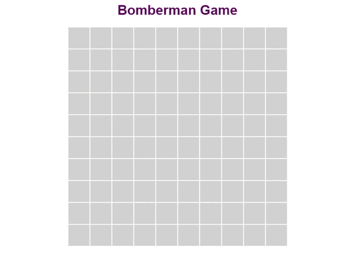

# Bomberman Game in JS

## Abilities

- Player can move in four directions: up, left, right, and down.
- Bomb is placed at a random location on the grid.
- Bomb explodes after a set period of time.
- If the player touches the bomb or is within the explosion range, they lose.
- Both the player's character and the bomb are styled using only CSS.

## Technologies Used

- HTML
- CSS
- Vanilla JavaScript

## Demo

